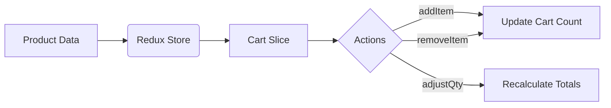

```markdown
# 🌱 Paradise Nursery - Plant E-Commerce React App


A responsive React-based shopping application for houseplants with Redux-powered cart management, featuring three interactive pages.

## 🚀 Features

### Landing Page
- Hero section with background image
- Company introduction paragraph
- "Get Started" button linking to products

### Product Listing Page
- **Categorized Display**: Plants organized into 3+ categories (e.g., Aromatic, Medicinal)
- **Product Cards** for 6+ plants showing:
  - Thumbnail image
  - Plant name & price
  - "Add to Cart" button
- **Dynamic Navbar** with cart counter

### Shopping Cart Page
- **Item Management** per product:
  - Thumbnail & name
  - Unit price & total cost
  - +/- quantity buttons
  - Delete button
- **Order Summary**:
  - Total item count
  - Grand total calculation
- Action buttons ("Continue Shopping", "Checkout")

## 🛠 Tech Stack
**Core**  


**Styling**  


## 📦 State Management


## 🚀 Installation
1. Clone the repository:
   ```bash
   git clone https://github.com/your-username/paradise-nursery.git
   ```
2. Install dependencies:
   ```bash
   npm install
   ```
3. Start the development server:
   ```bash
   npm start
   ```

## 🔍 Project Structure
```
src/
├── components/
│   ├── Cart/           # Cart components
│   ├── Product/        # Product cards
│   └── Shared/         # Navbar, buttons
├── features/
│   └── cartSlice.js    # Redux cart logic
├── pages/
│   ├── Landing.js
│   ├── Products.js
│   └── Cart.js
├── App.js              # Routes
└── index.js            # Redux store
```

## 🎯 Learning Outcomes
- Implemented **Redux Toolkit** for global state management
- Created **dynamic cart updates** with useEffect
- Developed **conditional rendering** for navigation
- Practiced **component composition** patterns
- Deployed via **GitHub Pages**

## 🌿 Future Enhancements
- [ ] User authentication
- [ ] Product search/filter
- [ ] Payment gateway integration

## 📜 License
[MIT](https://choosealicense.com/licenses/mit/)
```
